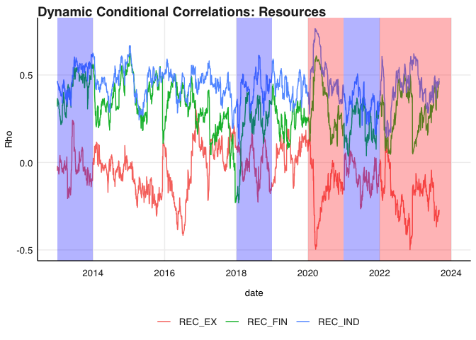

# Purpose

README for Financial Econometrics Project Essay.

Topic: Time-Varying correlation comparison of local indices \* Drivers
of TV-correlation estimates over time \* Comparing Financials,
Industrials and Resources - how their dynamic correlations changed over
time, perhaps related to interest rate regimes / currency volatilty
regimes.

``` r
rm(list = ls()) # Clean your environment:
gc() # garbage collection - It can be useful to call gc after a large object has been removed, as this may prompt R to return memory to the operating system.
```

    ##          used (Mb) gc trigger (Mb) limit (Mb) max used (Mb)
    ## Ncells 464496 24.9     992480 53.1         NA   669302 35.8
    ## Vcells 864093  6.6    8388608 64.0      16384  1840208 14.1

``` r
library(tidyverse)
```

    ## ── Attaching packages ─────────────────────────────────────── tidyverse 1.3.2 ──
    ## ✔ ggplot2 3.4.0     ✔ purrr   1.0.2
    ## ✔ tibble  3.2.1     ✔ dplyr   1.1.2
    ## ✔ tidyr   1.3.0     ✔ stringr 1.5.0
    ## ✔ readr   2.1.4     ✔ forcats 0.5.2
    ## ── Conflicts ────────────────────────────────────────── tidyverse_conflicts() ──
    ## ✖ dplyr::filter() masks stats::filter()
    ## ✖ dplyr::lag()    masks stats::lag()

``` r
library(lubridate)
```

    ## Loading required package: timechange
    ## 
    ## Attaching package: 'lubridate'
    ## 
    ## The following objects are masked from 'package:base':
    ## 
    ##     date, intersect, setdiff, union

``` r
library(fmxdat)
library(tbl2xts)
library(rmsfuns)
library(glue)
library(PortfolioAnalytics)
```

    ## Loading required package: zoo
    ## 
    ## Attaching package: 'zoo'
    ## 
    ## The following objects are masked from 'package:base':
    ## 
    ##     as.Date, as.Date.numeric
    ## 
    ## Loading required package: xts
    ## 
    ## ######################### Warning from 'xts' package ##########################
    ## #                                                                             #
    ## # The dplyr lag() function breaks how base R's lag() function is supposed to  #
    ## # work, which breaks lag(my_xts). Calls to lag(my_xts) that you type or       #
    ## # source() into this session won't work correctly.                            #
    ## #                                                                             #
    ## # Use stats::lag() to make sure you're not using dplyr::lag(), or you can add #
    ## # conflictRules('dplyr', exclude = 'lag') to your .Rprofile to stop           #
    ## # dplyr from breaking base R's lag() function.                                #
    ## #                                                                             #
    ## # Code in packages is not affected. It's protected by R's namespace mechanism #
    ## # Set `options(xts.warn_dplyr_breaks_lag = FALSE)` to suppress this warning.  #
    ## #                                                                             #
    ## ###############################################################################
    ## 
    ## Attaching package: 'xts'
    ## 
    ## The following objects are masked from 'package:dplyr':
    ## 
    ##     first, last
    ## 
    ## Loading required package: foreach
    ## 
    ## Attaching package: 'foreach'
    ## 
    ## The following objects are masked from 'package:purrr':
    ## 
    ##     accumulate, when
    ## 
    ## Loading required package: PerformanceAnalytics
    ## 
    ## Attaching package: 'PerformanceAnalytics'
    ## 
    ## The following object is masked from 'package:graphics':
    ## 
    ##     legend

``` r
library(rugarch)
```

    ## Loading required package: parallel
    ## 
    ## Attaching package: 'rugarch'
    ## 
    ## The following object is masked from 'package:purrr':
    ## 
    ##     reduce
    ## 
    ## The following object is masked from 'package:stats':
    ## 
    ##     sigma

``` r
library(forecast)
```

    ## Registered S3 method overwritten by 'quantmod':
    ##   method            from
    ##   as.zoo.data.frame zoo

``` r
library(gridExtra)
```

    ## 
    ## Attaching package: 'gridExtra'
    ## 
    ## The following object is masked from 'package:dplyr':
    ## 
    ##     combine

``` r
library(kableExtra)
```

    ## 
    ## Attaching package: 'kableExtra'
    ## 
    ## The following object is masked from 'package:dplyr':
    ## 
    ##     group_rows

``` r
library(rmgarch)
```

    ## 
    ## Attaching package: 'rmgarch'
    ## 
    ## The following objects are masked from 'package:xts':
    ## 
    ##     first, last
    ## 
    ## The following objects are masked from 'package:dplyr':
    ## 
    ##     first, last

``` r
library(MTS)
library(robustbase)
list.files('code/', full.names = T, recursive = T) %>% .[grepl('.R', .)] %>% as.list() %>% walk(~source(.))
```

# Data wrangling

Read in the data

``` r
alsi_raw <- read_rds("data/ALSI.rds")
currency <- read_rds("data/USDZAR.rds")
repo_raw <- read.csv("data/HistoricalRateDetail.csv")
```

I am going to use the data from the practical exam. It is the ALSI and
SWIX all share indexes. I am not sure if I should do the analysis on
just one of the indexes or both so I am just going to start with both
and I can always go back and just work with one.

``` r
#Lets rename the J403 to SWIX and J203 to ALSI and get them as different data sets. 
alsi_df <- alsi_raw %>% 
    rename("ALSI" = "J203", "SWIX"= "J403") %>% 
    mutate(ALSI = coalesce(ALSI,0)) %>% #This is what i should have done it the practical but we live and learn
    mutate(SWIX = coalesce(SWIX,0))

# Now I use a function that incorporates the rmsfuns safe portfolio returns
#I do this for all three sectors and for each fund
#SWIX
swix_fin<- calculate_sector_returns(alsi_df, "Financials", "SWIX") %>% 
    rename("Financials"="PortfolioReturn")

swix_rec<- calculate_sector_returns(alsi_df, "Resources", "SWIX") %>% 
    rename("Resources"="PortfolioReturn")

swix_ind <- calculate_sector_returns(alsi_df, "Industrials", "SWIX") %>% 
    rename("Industrials"="PortfolioReturn")

#ALSI
alsi_fin<- calculate_sector_returns(alsi_df, "Financials", "ALSI") %>% 
    rename("Financials"="PortfolioReturn")

alsi_rec<- calculate_sector_returns(alsi_df, "Resources", "ALSI") %>% 
    rename("Resources"="PortfolioReturn")

alsi_ind <- calculate_sector_returns(alsi_df, "Industrials", "ALSI") %>% 
    rename("Industrials"="PortfolioReturn")


#Now I just need to join them together into two data frames that will then be used to do the garch analysis
swix_portret <- 
    left_join(swix_fin, swix_rec, by = "date") %>% 
    left_join(. , swix_ind, by = "date")

alsi_portret <- 
    left_join(alsi_fin, alsi_rec, by = "date") %>% 
    left_join(., alsi_ind, by = "date")
```

Now I want to read in the data of the interest rate and exchange rate

``` r
# Let's clean up the repo data a bit
repo<- repo_raw %>% 
    slice(-(1:2)) %>%
    rename("repo"= "Description") %>% 
    mutate(date = ymd(Indicator)) %>% 
    filter(date>ymd(20121231)) %>% 
    select(date, repo)
```

# Garch fitting

## Return Persistence

This follows the practical and is complete with respect to the necessary
tests of ARCH

``` r
#I wrapped the code from the practical into a function where i just need to give the data (as a tbl) sector and it outputs the return persistence graphs
return_persistence_plotter(alsi_portret, "Financials")
```

    ## Warning in loadfonts_win(quiet = quiet): OS is not Windows. No fonts registered
    ## with windowsFonts().


``` r
return_persistence_plotter(alsi_portret, "Resources")
```

    ## Warning in loadfonts_win(quiet = quiet): OS is not Windows. No fonts registered
    ## with windowsFonts().


``` r
return_persistence_plotter(alsi_portret, "Industrials")
```

    ## Warning in loadfonts_win(quiet = quiet): OS is not Windows. No fonts registered
    ## with windowsFonts().


## Auto correlation functions

``` r
#here I again use the ggAcf, theme_fmx and finlot as well as gridExtra to get a nice plot of each sectors autocorrelation
acf_plotter(alsi_portret, "Financials")
```

    ## Warning in ggplot2::geom_segment(lineend = "butt", ...): Ignoring unknown
    ## parameters: `main`

    ## Warning in loadfonts_win(quiet = quiet): OS is not Windows. No fonts registered
    ## with windowsFonts().

    ## Warning in ggplot2::geom_segment(lineend = "butt", ...): Ignoring unknown
    ## parameters: `main`

    ## Warning in loadfonts_win(quiet = quiet): OS is not Windows. No fonts registered
    ## with windowsFonts().

    ## Warning in ggplot2::geom_segment(lineend = "butt", ...): Ignoring unknown
    ## parameters: `main`

    ## Warning in loadfonts_win(quiet = quiet): OS is not Windows. No fonts registered
    ## with windowsFonts().


``` r
acf_plotter(alsi_portret, "Resources")
```

    ## Warning in ggplot2::geom_segment(lineend = "butt", ...): Ignoring unknown
    ## parameters: `main`

    ## Warning in loadfonts_win(quiet = quiet): OS is not Windows. No fonts registered
    ## with windowsFonts().

    ## Warning in ggplot2::geom_segment(lineend = "butt", ...): Ignoring unknown
    ## parameters: `main`

    ## Warning in loadfonts_win(quiet = quiet): OS is not Windows. No fonts registered
    ## with windowsFonts().

    ## Warning in ggplot2::geom_segment(lineend = "butt", ...): Ignoring unknown
    ## parameters: `main`

    ## Warning in loadfonts_win(quiet = quiet): OS is not Windows. No fonts registered
    ## with windowsFonts().


``` r
acf_plotter(alsi_portret, "Industrials")
```

    ## Warning in ggplot2::geom_segment(lineend = "butt", ...): Ignoring unknown
    ## parameters: `main`

    ## Warning in loadfonts_win(quiet = quiet): OS is not Windows. No fonts registered
    ## with windowsFonts().

    ## Warning in ggplot2::geom_segment(lineend = "butt", ...): Ignoring unknown
    ## parameters: `main`

    ## Warning in loadfonts_win(quiet = quiet): OS is not Windows. No fonts registered
    ## with windowsFonts().

    ## Warning in ggplot2::geom_segment(lineend = "butt", ...): Ignoring unknown
    ## parameters: `main`

    ## Warning in loadfonts_win(quiet = quiet): OS is not Windows. No fonts registered
    ## with windowsFonts().


## Box tests

``` r
box_test<- function(data, sector){
    if(sector == "Financials"){
        play_df<- data %>%
            select(date, Financials) %>%
            tbl_xts()
    }

    if(sector == "Resources"){
        play_df<- data %>%
            select(date, Resources) %>%
            tbl_xts()
    }

    if(sector == "Industrials"){
        play_df<- data %>%
            select(date, Industrials) %>%
            tbl_xts()
    }
 box_test_result <- Box.test(coredata(play_df^2), type = "Ljung-Box", lag = 12)

  # Create a data frame with the test result
  result_df <- data.frame(
    TestStatistic = box_test_result$statistic,
    PValue = box_test_result$p.value,
    Lag = box_test_result$parameter
  )

  # Print the data frame as a nice table using kable
  kable(result_df, caption =glue("Ljung-Box Test Results: {sector}"))

}
box_test(alsi_portret, "Financials")
```

<table>
<caption>
Ljung-Box Test Results: Financials
</caption>
<thead>
<tr>
<th style="text-align:left;">
</th>
<th style="text-align:right;">
TestStatistic
</th>
<th style="text-align:right;">
PValue
</th>
<th style="text-align:right;">
Lag
</th>
</tr>
</thead>
<tbody>
<tr>
<td style="text-align:left;">
X-squared
</td>
<td style="text-align:right;">
2667.797
</td>
<td style="text-align:right;">
0
</td>
<td style="text-align:right;">
12
</td>
</tr>
</tbody>
</table>

``` r
box_test_all_sectors <- function(data, sectors) {
  results_list <- list()

  for (sector in sectors) {
    if (sector %in% colnames(data)) {
      play_df <- data %>%
        select(date, !!sym(sector)) %>%
        tbl_xts()

      box_test_result <- Box.test(coredata(play_df^2), type = "Ljung-Box", lag = 12)

      results_list[[sector]] <- data.frame(
        TestStatistic = box_test_result$statistic,
        PValue = box_test_result$p.value,
        Lag = box_test_result$parameter
      )
    } else {
      warning(paste("Sector", sector, "not found in the data. Skipping."))
    }
  }
   # Combine all results into a single data frame
  result_df <- do.call(rbind, results_list)

  # Print the data frame as a nice table using kable
  kable(result_df, caption = "Ljung-Box Test Results")
}

box_test_all_sectors(alsi_portret, sectors = c("Financials", "Resources", "Industrials"))
```

<table>
<caption>
Ljung-Box Test Results
</caption>
<thead>
<tr>
<th style="text-align:left;">
</th>
<th style="text-align:right;">
TestStatistic
</th>
<th style="text-align:right;">
PValue
</th>
<th style="text-align:right;">
Lag
</th>
</tr>
</thead>
<tbody>
<tr>
<td style="text-align:left;">
Financials
</td>
<td style="text-align:right;">
2667.7971
</td>
<td style="text-align:right;">
0
</td>
<td style="text-align:right;">
12
</td>
</tr>
<tr>
<td style="text-align:left;">
Resources
</td>
<td style="text-align:right;">
1431.3349
</td>
<td style="text-align:right;">
0
</td>
<td style="text-align:right;">
12
</td>
</tr>
<tr>
<td style="text-align:left;">
Industrials
</td>
<td style="text-align:right;">
948.8227
</td>
<td style="text-align:right;">
0
</td>
<td style="text-align:right;">
12
</td>
</tr>
</tbody>
</table>

## Rugarch

``` r
# Wrapping the function from the practical into a function so that it can be mapped onto 
garch_model_comparison <- function(data, sector) {
  models <- 1:4
  model_list <- list()

  for (p in models) {
    garchfit <- ugarchspec(
      variance.model = list(model = c("sGARCH", "gjrGARCH", "eGARCH", "apARCH")[p], garchOrder = c(1, 1)),
      mean.model = list(armaOrder = c(1, 0), include.mean = TRUE),
      distribution.model = c("norm", "snorm", "std", "sstd", "ged", "sged", "nig", "ghyp", "jsu")[1]
    )

    garchfit1 <- ugarchfit(spec = garchfit, data = as.numeric(data[[sector]]))
    model_list[[p]] <- garchfit1
  }

  names(model_list) <- c("sGARCH", "gjrGARCH", "eGARCH", "apARCH")

  fit_mat <- sapply(model_list, infocriteria)
  rownames(fit_mat) <- rownames(infocriteria(model_list[[1]]))

  # Combine the results into a single data frame
  result_df <- data.frame(
    Sector = sector,
    fit_mat
  )

  result_df
}

# Apply the GARCH model comparison to all sectors
sectors <- c("Financials", "Resources", "Industrials")
garch_results <- lapply(sectors, function(sector) garch_model_comparison(alsi_portret, sector))

# Combine the results into a single data frame
combined_results <- do.call(rbind, garch_results)

# Print the combined results as a nice table using kable
kable(combined_results, caption = "GARCH Model Comparison Results")
```

<table>
<caption>
GARCH Model Comparison Results
</caption>
<thead>
<tr>
<th style="text-align:left;">
</th>
<th style="text-align:left;">
Sector
</th>
<th style="text-align:right;">
sGARCH
</th>
<th style="text-align:right;">
gjrGARCH
</th>
<th style="text-align:right;">
eGARCH
</th>
<th style="text-align:right;">
apARCH
</th>
</tr>
</thead>
<tbody>
<tr>
<td style="text-align:left;">
Akaike
</td>
<td style="text-align:left;">
Financials
</td>
<td style="text-align:right;">
-5.872282
</td>
<td style="text-align:right;">
-5.881912
</td>
<td style="text-align:right;">
-5.881702
</td>
<td style="text-align:right;">
-5.884481
</td>
</tr>
<tr>
<td style="text-align:left;">
Bayes
</td>
<td style="text-align:left;">
Financials
</td>
<td style="text-align:right;">
-5.861235
</td>
<td style="text-align:right;">
-5.868656
</td>
<td style="text-align:right;">
-5.868446
</td>
<td style="text-align:right;">
-5.869016
</td>
</tr>
<tr>
<td style="text-align:left;">
Shibata
</td>
<td style="text-align:left;">
Financials
</td>
<td style="text-align:right;">
-5.872289
</td>
<td style="text-align:right;">
-5.881922
</td>
<td style="text-align:right;">
-5.881712
</td>
<td style="text-align:right;">
-5.884495
</td>
</tr>
<tr>
<td style="text-align:left;">
Hannan-Quinn
</td>
<td style="text-align:left;">
Financials
</td>
<td style="text-align:right;">
-5.868285
</td>
<td style="text-align:right;">
-5.877115
</td>
<td style="text-align:right;">
-5.876905
</td>
<td style="text-align:right;">
-5.878885
</td>
</tr>
<tr>
<td style="text-align:left;">
Akaike1
</td>
<td style="text-align:left;">
Resources
</td>
<td style="text-align:right;">
-5.466560
</td>
<td style="text-align:right;">
-5.479735
</td>
<td style="text-align:right;">
-5.475142
</td>
<td style="text-align:right;">
-5.479025
</td>
</tr>
<tr>
<td style="text-align:left;">
Bayes1
</td>
<td style="text-align:left;">
Resources
</td>
<td style="text-align:right;">
-5.455513
</td>
<td style="text-align:right;">
-5.466479
</td>
<td style="text-align:right;">
-5.461886
</td>
<td style="text-align:right;">
-5.463559
</td>
</tr>
<tr>
<td style="text-align:left;">
Shibata1
</td>
<td style="text-align:left;">
Resources
</td>
<td style="text-align:right;">
-5.466567
</td>
<td style="text-align:right;">
-5.479745
</td>
<td style="text-align:right;">
-5.475153
</td>
<td style="text-align:right;">
-5.479038
</td>
</tr>
<tr>
<td style="text-align:left;">
Hannan-Quinn1
</td>
<td style="text-align:left;">
Resources
</td>
<td style="text-align:right;">
-5.462562
</td>
<td style="text-align:right;">
-5.474938
</td>
<td style="text-align:right;">
-5.470345
</td>
<td style="text-align:right;">
-5.473428
</td>
</tr>
<tr>
<td style="text-align:left;">
Akaike2
</td>
<td style="text-align:left;">
Industrials
</td>
<td style="text-align:right;">
-6.246073
</td>
<td style="text-align:right;">
-6.267709
</td>
<td style="text-align:right;">
-6.270655
</td>
<td style="text-align:right;">
-6.261725
</td>
</tr>
<tr>
<td style="text-align:left;">
Bayes2
</td>
<td style="text-align:left;">
Industrials
</td>
<td style="text-align:right;">
-6.235026
</td>
<td style="text-align:right;">
-6.254453
</td>
<td style="text-align:right;">
-6.257399
</td>
<td style="text-align:right;">
-6.246260
</td>
</tr>
<tr>
<td style="text-align:left;">
Shibata2
</td>
<td style="text-align:left;">
Industrials
</td>
<td style="text-align:right;">
-6.246080
</td>
<td style="text-align:right;">
-6.267719
</td>
<td style="text-align:right;">
-6.270665
</td>
<td style="text-align:right;">
-6.261739
</td>
</tr>
<tr>
<td style="text-align:left;">
Hannan-Quinn2
</td>
<td style="text-align:left;">
Industrials
</td>
<td style="text-align:right;">
-6.242075
</td>
<td style="text-align:right;">
-6.262912
</td>
<td style="text-align:right;">
-6.265858
</td>
<td style="text-align:right;">
-6.256129
</td>
</tr>
</tbody>
</table>

apARCH performs the best for Financials and Resources so we will use
that for the fit.

I think it could be informative to show the news impact curves to
highlight the differences between the different types of model specs

# Multivariate

``` r
renamingdcc <- function(ReturnSeries, DCC.TV.Cor) {
  
ncolrtn <- ncol(ReturnSeries)
namesrtn <- colnames(ReturnSeries)
paste(namesrtn, collapse = "_")

nam <- c()
xx <- mapply(rep, times = ncolrtn:1, x = namesrtn)
# Now let's be creative in designing a nested for loop to save the names corresponding to the columns of interest.. 

# TIP: draw what you want to achieve on a paper first. Then apply code.

# See if you can do this on your own first.. Then check vs my solution:

nam <- c()
for (j in 1:(ncolrtn)) {
for (i in 1:(ncolrtn)) {
  nam[(i + (j-1)*(ncolrtn))] <- paste(xx[[j]][1], xx[[i]][1], sep="_")
}
}

colnames(DCC.TV.Cor) <- nam

# So to plot all the time-varying correlations wrt SBK:
 # First append the date column that has (again) been removed...
DCC.TV.Cor <- 
    data.frame( cbind( date = index(ReturnSeries), DCC.TV.Cor)) %>% # Add date column which dropped away...
    mutate(date = as.Date(date)) %>%  tbl_df() 

DCC.TV.Cor <- DCC.TV.Cor %>% gather(Pairs, Rho, -date)

DCC.TV.Cor

}
```

``` r
xts_rtn <- alsi_portret %>% 
    rename("FIN" = "Financials", "REC"= "Resources", "IND" = "Industrials")%>% tbl_xts()

#Now set the specifications for the go garch
uspec <- ugarchspec(variance.model = list(model = "apARCH", 
    garchOrder = c(1, 1)), mean.model = list(armaOrder = c(1, 
    0), include.mean = TRUE), distribution.model = "sstd")

multi_univ_garch_spec <- multispec(replicate(ncol(xts_rtn), uspec))

spec.go <- gogarchspec(multi_univ_garch_spec, 
                       distribution.model = 'mvnorm', # or manig.
                       ica = 'fastica') # Note: we use the fastICA
cl <- makePSOCKcluster(10)
multf <- multifit(multi_univ_garch_spec, xts_rtn, cluster = cl)

fit.gogarch <- gogarchfit(spec.go, 
                      data = xts_rtn, 
                      solver = 'hybrid', 
                      cluster = cl, 
                      gfun = 'tanh', 
                      maxiter1 = 40000, 
                      epsilon = 1e-08, 
                      rseed = 100)

gog.time.var.cor <- rcor(fit.gogarch)
gog.time.var.cor <- aperm(gog.time.var.cor,c(3,2,1))
dim(gog.time.var.cor) <- c(nrow(gog.time.var.cor), ncol(gog.time.var.cor)^2)
# Finally:
gog.time.var.cor <-
renamingdcc(ReturnSeries = xts_rtn, DCC.TV.Cor = gog.time.var.cor)
```

    ## Warning: `tbl_df()` was deprecated in dplyr 1.0.0.
    ## ℹ Please use `tibble::as_tibble()` instead.
    ## Call `lifecycle::last_lifecycle_warnings()` to see where this warning was
    ## generated.

``` r
go1 <- ggplot(gog.time.var.cor %>% filter(grepl("FIN_", Pairs), 
    !grepl("_FIN", Pairs))) + geom_line(aes(x = date, y = Rho, 
    colour = Pairs)) + theme_fmx() + ggtitle("Go-GARCH: FIN")
```

    ## Warning in loadfonts_win(quiet = quiet): OS is not Windows. No fonts registered
    ## with windowsFonts().

``` r
go2 <- ggplot(gog.time.var.cor %>% filter(grepl("REC_", Pairs), 
    !grepl("_REC", Pairs))) + geom_line(aes(x = date, y = Rho, 
    colour = Pairs)) + theme_fmx() + ggtitle("Go-GARCH: REC")
```

    ## Warning in loadfonts_win(quiet = quiet): OS is not Windows. No fonts registered
    ## with windowsFonts().

``` r
go3 <- ggplot(gog.time.var.cor %>% filter(grepl("IND_", Pairs), 
    !grepl("_IND", Pairs))) + geom_line(aes(x = date, y = Rho, 
    colour = Pairs)) + theme_fmx() + ggtitle("Go-GARCH: IND")
```

    ## Warning in loadfonts_win(quiet = quiet): OS is not Windows. No fonts registered
    ## with windowsFonts().

``` r
finplot(go1)
```


``` r
finplot(go2)
```



``` r
finplot(go3)
```


