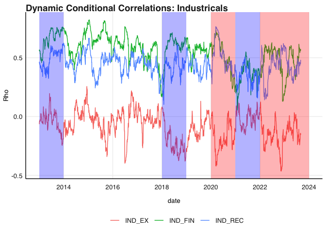
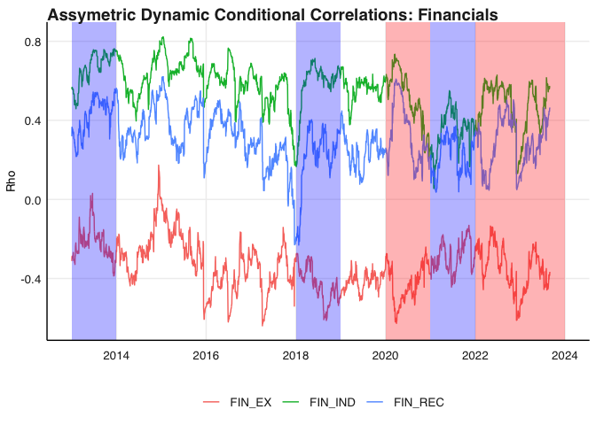
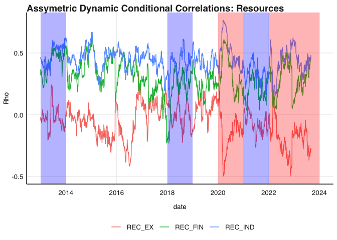
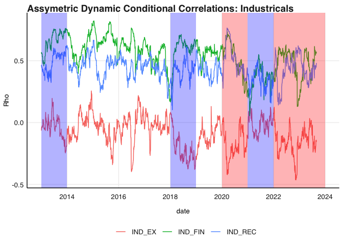
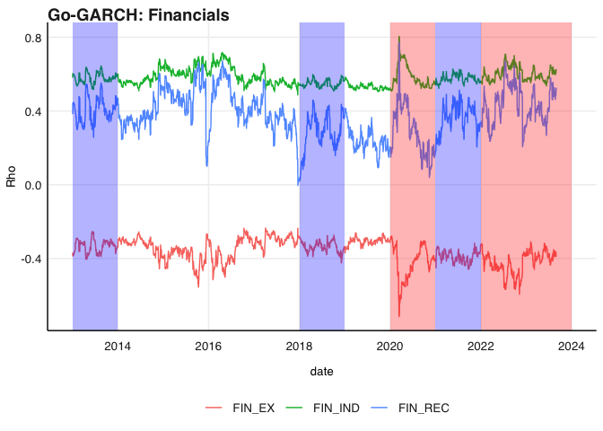
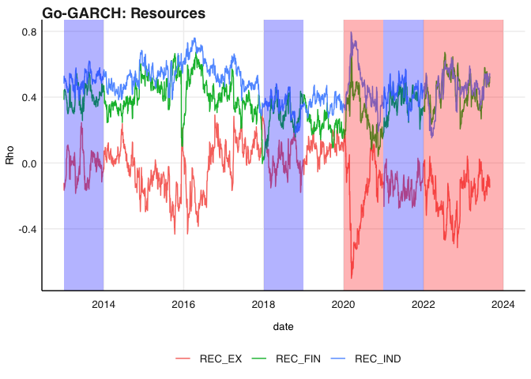
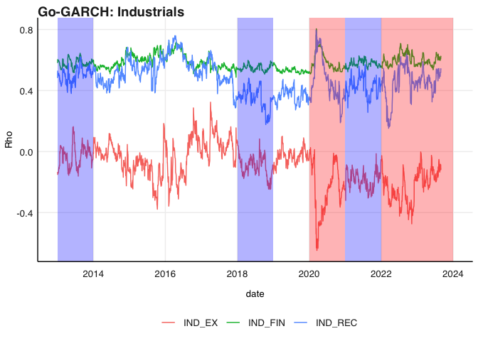

# Purpose

The purpose of this README is to guide readers as well as myself through
my code. It provides explanations of functions as well as the reasoning
for my code. I aim to code in a functional manner. My project is based
on the following topic:

Topic: Time-Varying correlation comparison of local indices

-   Drivers of TV-correlation estimates over time

-   Comparing Financials, Industrials and Resources - how their dynamic
    correlations changed over time, perhaps related to interest rate
    regimes / currency volatilty regimes.

# Loading packages

I have added the packages that I use at the beginning with the exception
of rmgarch because it has conflicts with packeages in the tidyverse

``` r
rm(list = ls()) # Clean your environment:
gc() # garbage collection - It can be useful to call gc after a large object has been removed, as this may prompt R to return memory to the operating system.
```

    ##          used (Mb) gc trigger (Mb) limit (Mb) max used (Mb)
    ## Ncells 465959 24.9     996660 53.3         NA   669302 35.8
    ## Vcells 868870  6.7    8388608 64.0      16384  1840206 14.1

``` r
library(tidyverse)
```

    ## ── Attaching packages ─────────────────────────────────────── tidyverse 1.3.2 ──
    ## ✔ ggplot2 3.4.0     ✔ purrr   1.0.2
    ## ✔ tibble  3.2.1     ✔ dplyr   1.1.2
    ## ✔ tidyr   1.3.0     ✔ stringr 1.5.0
    ## ✔ readr   2.1.4     ✔ forcats 0.5.2
    ## ── Conflicts ────────────────────────────────────────── tidyverse_conflicts() ──
    ## ✖ dplyr::filter() masks stats::filter()
    ## ✖ dplyr::lag()    masks stats::lag()

``` r
library(lubridate)
```

    ## Loading required package: timechange
    ## 
    ## Attaching package: 'lubridate'
    ## 
    ## The following objects are masked from 'package:base':
    ## 
    ##     date, intersect, setdiff, union

``` r
library(fmxdat)
library(tbl2xts)
library(rmsfuns)
library(glue)
library(PortfolioAnalytics)
```

    ## Loading required package: zoo
    ## 
    ## Attaching package: 'zoo'
    ## 
    ## The following objects are masked from 'package:base':
    ## 
    ##     as.Date, as.Date.numeric
    ## 
    ## Loading required package: xts
    ## 
    ## ######################### Warning from 'xts' package ##########################
    ## #                                                                             #
    ## # The dplyr lag() function breaks how base R's lag() function is supposed to  #
    ## # work, which breaks lag(my_xts). Calls to lag(my_xts) that you type or       #
    ## # source() into this session won't work correctly.                            #
    ## #                                                                             #
    ## # Use stats::lag() to make sure you're not using dplyr::lag(), or you can add #
    ## # conflictRules('dplyr', exclude = 'lag') to your .Rprofile to stop           #
    ## # dplyr from breaking base R's lag() function.                                #
    ## #                                                                             #
    ## # Code in packages is not affected. It's protected by R's namespace mechanism #
    ## # Set `options(xts.warn_dplyr_breaks_lag = FALSE)` to suppress this warning.  #
    ## #                                                                             #
    ## ###############################################################################
    ## 
    ## Attaching package: 'xts'
    ## 
    ## The following objects are masked from 'package:dplyr':
    ## 
    ##     first, last
    ## 
    ## Loading required package: foreach
    ## 
    ## Attaching package: 'foreach'
    ## 
    ## The following objects are masked from 'package:purrr':
    ## 
    ##     accumulate, when
    ## 
    ## Loading required package: PerformanceAnalytics
    ## 
    ## Attaching package: 'PerformanceAnalytics'
    ## 
    ## The following object is masked from 'package:graphics':
    ## 
    ##     legend

``` r
library(rugarch)
```

    ## Loading required package: parallel
    ## 
    ## Attaching package: 'rugarch'
    ## 
    ## The following object is masked from 'package:purrr':
    ## 
    ##     reduce
    ## 
    ## The following object is masked from 'package:stats':
    ## 
    ##     sigma

``` r
library(forecast)
```

    ## Registered S3 method overwritten by 'quantmod':
    ##   method            from
    ##   as.zoo.data.frame zoo

``` r
library(gridExtra)
```

    ## 
    ## Attaching package: 'gridExtra'
    ## 
    ## The following object is masked from 'package:dplyr':
    ## 
    ##     combine

``` r
library(kableExtra)
```

    ## 
    ## Attaching package: 'kableExtra'
    ## 
    ## The following object is masked from 'package:dplyr':
    ## 
    ##     group_rows

``` r
# library(rmgarch)
library(MTS)
library(robustbase)
list.files('code/', full.names = T, recursive = T) %>% .[grepl('.R', .)] %>% as.list() %>% walk(~source(.))
```

# Data wrangling

I am going to use the data from the practical exam. It is the ALSI and
SWIX all share indexes. I am not sure if I should do the analysis on
just one of the indexes or both. I start by just using the ALSI but the
code that follows allows for the use of either if I want to come back
and do the analysis on both. Both indexes are all share indexes so it
should not make much of a difference to the results but could be useful
for a robustness check if needed but may fall out of the scope of this
project.

``` r
alsi_raw <- read_rds("data/ALSI.rds")
currency <- read_rds("data/USDZAR.rds")
repo_raw <- read.csv("data/HistoricalRateDetail.csv")
```

The following code chunk wrangles and cleans the data. The
calculate_sector_returns functions does the following:

-   Uses an if function to select a fund (fund_name), extracts the
    specified sector (sector_name), reweights the weights to sum to 1
-   Creates a weights and return xts data frame to use with rmsfun safe
    portfolio return calculator
-   Calculates the sector return and extracts the relevant components
    (contribution, weights and value)
-   Joins the components together to give the final total return for
    each sector

I then rename the portfolio return to the sector name and join the all
the sectors in each index together,

``` r
#Lets rename the J403 to SWIX and J203 to ALSI and get them as different data sets. 
alsi_df <- alsi_raw %>% 
    rename("ALSI" = "J203", "SWIX"= "J403") %>% 
    mutate(ALSI = coalesce(ALSI,0)) %>% #This is what i should have done it the practical but we live and learn
    mutate(SWIX = coalesce(SWIX,0))

# Now I use a function that incorporates the rmsfuns safe portfolio returns
#I do this for all three sectors and for each fund
#SWIX
swix_fin<- calculate_sector_returns(data = alsi_df, sector_name = "Financials", fund_name = "SWIX") %>% 
    rename("Financials"="PortfolioReturn")

swix_rec<- calculate_sector_returns(alsi_df, "Resources", "SWIX") %>% 
    rename("Resources"="PortfolioReturn")

swix_ind <- calculate_sector_returns(alsi_df, "Industrials", "SWIX") %>% 
    rename("Industrials"="PortfolioReturn")

#ALSI
alsi_fin<- calculate_sector_returns(alsi_df, "Financials", "ALSI") %>% 
    rename("Financials"="PortfolioReturn")

alsi_rec<- calculate_sector_returns(alsi_df, "Resources", "ALSI") %>% 
    rename("Resources"="PortfolioReturn")

alsi_ind <- calculate_sector_returns(alsi_df, "Industrials", "ALSI") %>% 
    rename("Industrials"="PortfolioReturn")


#Now I just need to join them together into two data frames that will then be used to do the garch analysis
swix_portret <- 
    left_join(swix_fin, swix_rec, by = "date") %>% 
    left_join(. , swix_ind, by = "date")

alsi_portret <- 
    left_join(alsi_fin, alsi_rec, by = "date") %>% 
    left_join(., alsi_ind, by = "date")
```

The following cleans and wrangles the repo rate data that was obtained
from the SARB so that is matches the datafame above.

``` r
# Let's clean up the repo data a bit
repo<- repo_raw %>% 
    slice(-(1:2)) %>%
    rename("repo"= "Description") %>% 
    mutate(date = ymd(Indicator),
           repo = as.numeric(repo)/100) %>% 
    filter(date>ymd(20121231)) %>% 
    select(date, repo)
```

# Garch fitting and ARCH testing

This follows the practical and is complete with respect to the necessary
tests of ARCH. From here I only use the ALSI index but I can simply
input the swix_portret instead of alsi_portret for all the functions and
do the analysis on the SWIX as well. \## Return Persistence I created a
function that essentially wrapped the code to plot the return
persistence into a function so I can plot each sector.

``` r
#I wrapped the code from the practical into a function where i just need to give the data (as a tbl) sector and it outputs the return persistence graphs
return_persistence_plotter(data = alsi_portret, sector =  "Financials")
```


``` r
return_persistence_plotter(alsi_portret, "Resources")
```


``` r
return_persistence_plotter(alsi_portret, "Industrials")
```


## Auto correlation functions

``` r
#here I again use the ggAcf, theme_fmx and finlot as well as gridExtra to get a nice plot of each sectors autocorrelation
acf_plotter(alsi_portret, "Financials")
```


``` r
acf_plotter(alsi_portret, "Resources")
```


``` r
acf_plotter(alsi_portret, "Industrials")
```

 The ACFs
show that there does appear to be strong conditional heteroskedasticity
and long memory showing that there is large return persistence but it is
also necassary to conduct a formal box test to prove it.

## Box tests

I started by writing a function that could output the box test for each
sector but then decided to rather include a for loop that gets the
relavant statistics for each sector and rbinds them together and outputs
a single table.

``` r
# box_test<- function(data, sector){
#     if(sector == "Financials"){
#         play_df<- data %>%
#             select(date, Financials) %>%
#             tbl_xts()
#     }
# 
#     if(sector == "Resources"){
#         play_df<- data %>%
#             select(date, Resources) %>%
#             tbl_xts()
#     }
# 
#     if(sector == "Industrials"){
#         play_df<- data %>%
#             select(date, Industrials) %>%
#             tbl_xts()
#     }
#  box_test_result <- Box.test(coredata(play_df^2), type = "Ljung-Box", lag = 12)
# 
#   # Create a data frame with the test result
#   result_df <- data.frame(
#     TestStatistic = box_test_result$statistic,
#     PValue = box_test_result$p.value,
#     Lag = box_test_result$parameter
#   )
# 
#   # Print the data frame as a nice table using kable
#   kable(result_df, caption =glue("Ljung-Box Test Results: {sector}"))
# }
# box_test(alsi_portret, "Financials")
```

``` r
box_test_all_sectors <- function(data, sectors) {
  results_list <- list()

  for (sector in sectors) {
    if (sector %in% colnames(data)) {
      play_df <- data %>%
        select(date, !!sym(sector)) %>%
        tbl_xts()

      box_test_result <- Box.test(coredata(play_df^2), type = "Ljung-Box", lag = 12)

      results_list[[sector]] <- data.frame(
        TestStatistic = box_test_result$statistic,
        PValue = box_test_result$p.value,
        Lag = box_test_result$parameter
      )
    } else {
      warning(paste("Sector", sector, "not found in the data. Skipping."))
    }
  }
   # Combine all results into a single data frame
  result_df <- do.call(rbind, results_list)

  # Print the data frame as a nice table using kable
  kable(result_df, caption = "Ljung-Box Test Results")
}

box_test_foo(alsi_portret, sectors = c("Financials", "Resources", "Industrials"))
```

<table>
<caption>
Ljung-Box Test Results
</caption>
<thead>
<tr>
<th style="text-align:left;">
</th>
<th style="text-align:right;">
TestStatistic
</th>
<th style="text-align:right;">
PValue
</th>
<th style="text-align:right;">
Lag
</th>
</tr>
</thead>
<tbody>
<tr>
<td style="text-align:left;">
Financials
</td>
<td style="text-align:right;">
2667.7971
</td>
<td style="text-align:right;">
0
</td>
<td style="text-align:right;">
12
</td>
</tr>
<tr>
<td style="text-align:left;">
Resources
</td>
<td style="text-align:right;">
1431.3349
</td>
<td style="text-align:right;">
0
</td>
<td style="text-align:right;">
12
</td>
</tr>
<tr>
<td style="text-align:left;">
Industrials
</td>
<td style="text-align:right;">
948.8227
</td>
<td style="text-align:right;">
0
</td>
<td style="text-align:right;">
12
</td>
</tr>
</tbody>
</table>

The p-value for all sectors as extremely small therefore the results of
the box tests rejects the null hypothesis that there are no ARCH
effects. This is sufficient motivation to control for the conditional
heteroskedasticity.

## Rugarch

Below I wrap the model comparison code from the practical in a function
so that I can then use lapply to apply the function to each sector and
then use do.call to combine the results into a single table.

``` r
# Apply the GARCH model comparison to all sectors
sectors <- c("Financials", "Resources", "Industrials")
garch_results <- lapply(sectors, function(sector) garch_model_comparison(alsi_portret, sector))

# Combine the results into a single data frame
combined_results <- do.call(rbind, garch_results)

# Print the combined results as a nice table using kable
kable(combined_results, caption = "GARCH Model Comparison Results")
```

<table>
<caption>
GARCH Model Comparison Results
</caption>
<thead>
<tr>
<th style="text-align:left;">
</th>
<th style="text-align:left;">
Sector
</th>
<th style="text-align:right;">
sGARCH
</th>
<th style="text-align:right;">
gjrGARCH
</th>
<th style="text-align:right;">
eGARCH
</th>
<th style="text-align:right;">
apARCH
</th>
</tr>
</thead>
<tbody>
<tr>
<td style="text-align:left;">
Akaike
</td>
<td style="text-align:left;">
Financials
</td>
<td style="text-align:right;">
-5.872282
</td>
<td style="text-align:right;">
-5.881912
</td>
<td style="text-align:right;">
-5.881702
</td>
<td style="text-align:right;">
-5.884481
</td>
</tr>
<tr>
<td style="text-align:left;">
Bayes
</td>
<td style="text-align:left;">
Financials
</td>
<td style="text-align:right;">
-5.861235
</td>
<td style="text-align:right;">
-5.868656
</td>
<td style="text-align:right;">
-5.868446
</td>
<td style="text-align:right;">
-5.869016
</td>
</tr>
<tr>
<td style="text-align:left;">
Shibata
</td>
<td style="text-align:left;">
Financials
</td>
<td style="text-align:right;">
-5.872289
</td>
<td style="text-align:right;">
-5.881922
</td>
<td style="text-align:right;">
-5.881712
</td>
<td style="text-align:right;">
-5.884495
</td>
</tr>
<tr>
<td style="text-align:left;">
Hannan-Quinn
</td>
<td style="text-align:left;">
Financials
</td>
<td style="text-align:right;">
-5.868285
</td>
<td style="text-align:right;">
-5.877115
</td>
<td style="text-align:right;">
-5.876905
</td>
<td style="text-align:right;">
-5.878885
</td>
</tr>
<tr>
<td style="text-align:left;">
Akaike1
</td>
<td style="text-align:left;">
Resources
</td>
<td style="text-align:right;">
-5.466560
</td>
<td style="text-align:right;">
-5.479735
</td>
<td style="text-align:right;">
-5.475142
</td>
<td style="text-align:right;">
-5.479025
</td>
</tr>
<tr>
<td style="text-align:left;">
Bayes1
</td>
<td style="text-align:left;">
Resources
</td>
<td style="text-align:right;">
-5.455513
</td>
<td style="text-align:right;">
-5.466479
</td>
<td style="text-align:right;">
-5.461886
</td>
<td style="text-align:right;">
-5.463559
</td>
</tr>
<tr>
<td style="text-align:left;">
Shibata1
</td>
<td style="text-align:left;">
Resources
</td>
<td style="text-align:right;">
-5.466567
</td>
<td style="text-align:right;">
-5.479745
</td>
<td style="text-align:right;">
-5.475153
</td>
<td style="text-align:right;">
-5.479038
</td>
</tr>
<tr>
<td style="text-align:left;">
Hannan-Quinn1
</td>
<td style="text-align:left;">
Resources
</td>
<td style="text-align:right;">
-5.462562
</td>
<td style="text-align:right;">
-5.474938
</td>
<td style="text-align:right;">
-5.470345
</td>
<td style="text-align:right;">
-5.473428
</td>
</tr>
<tr>
<td style="text-align:left;">
Akaike2
</td>
<td style="text-align:left;">
Industrials
</td>
<td style="text-align:right;">
-6.246073
</td>
<td style="text-align:right;">
-6.267709
</td>
<td style="text-align:right;">
-6.270655
</td>
<td style="text-align:right;">
-6.261725
</td>
</tr>
<tr>
<td style="text-align:left;">
Bayes2
</td>
<td style="text-align:left;">
Industrials
</td>
<td style="text-align:right;">
-6.235026
</td>
<td style="text-align:right;">
-6.254453
</td>
<td style="text-align:right;">
-6.257399
</td>
<td style="text-align:right;">
-6.246260
</td>
</tr>
<tr>
<td style="text-align:left;">
Shibata2
</td>
<td style="text-align:left;">
Industrials
</td>
<td style="text-align:right;">
-6.246080
</td>
<td style="text-align:right;">
-6.267719
</td>
<td style="text-align:right;">
-6.270665
</td>
<td style="text-align:right;">
-6.261739
</td>
</tr>
<tr>
<td style="text-align:left;">
Hannan-Quinn2
</td>
<td style="text-align:left;">
Industrials
</td>
<td style="text-align:right;">
-6.242075
</td>
<td style="text-align:right;">
-6.262912
</td>
<td style="text-align:right;">
-6.265858
</td>
<td style="text-align:right;">
-6.256129
</td>
</tr>
</tbody>
</table>

apARCH performs the best for Financials and Resources so we will use
that for the fit.

I think it could be informative to show the news impact curves to
highlight the differences between the different types of model specs

# Multivariate

Following the literature (Cite) comparisons between DCC, aDCC GO-GARCH
are used.

``` r
#For all of the multivariate estimates we need to call in the renamingdcc function from the practical to make the extraction of the correlation 
# estimates easier 
renamingdcc <- function(ReturnSeries, DCC.TV.Cor) {
  
ncolrtn <- ncol(ReturnSeries)
namesrtn <- colnames(ReturnSeries)
paste(namesrtn, collapse = "_")

nam <- c()
xx <- mapply(rep, times = ncolrtn:1, x = namesrtn)
# Now let's be creative in designing a nested for loop to save the names corresponding to the columns of interest.. 

# TIP: draw what you want to achieve on a paper first. Then apply code.

# See if you can do this on your own first.. Then check vs my solution:

nam <- c()
for (j in 1:(ncolrtn)) {
for (i in 1:(ncolrtn)) {
  nam[(i + (j-1)*(ncolrtn))] <- paste(xx[[j]][1], xx[[i]][1], sep="_")
}
}

colnames(DCC.TV.Cor) <- nam

# So to plot all the time-varying correlations wrt SBK:
 # First append the date column that has (again) been removed...
DCC.TV.Cor <- 
    data.frame( cbind( date = index(ReturnSeries), DCC.TV.Cor)) %>% # Add date column which dropped away...
    mutate(date = as.Date(date)) %>%  tbl_df() 

DCC.TV.Cor <- DCC.TV.Cor %>% gather(Pairs, Rho, -date)

DCC.TV.Cor

}
```

## DCC

``` r
library(tidyverse)
xts_rtn <- alsi_portret %>% 
    rename("FIN" = "Financials", "REC"= "Resources", "IND" = "Industrials") %>% # This is to get more easible readible paies
    left_join(., currency %>% mutate(EX = value/lag(value)-1) %>% filter(date > dplyr::first(date)) %>% select(date, EX), by = "date") %>% 
    tbl_xts()
```

``` r
library(rmgarch)
```

    ## 
    ## Attaching package: 'rmgarch'

    ## The following objects are masked from 'package:xts':
    ## 
    ##     first, last

    ## The following objects are masked from 'package:dplyr':
    ## 
    ##     first, last

``` r
#Now set the specifications for both the dcc and go-garch
#a) Set the Univaariate GARCH  spec (using aparch from the table above)
uspec <- ugarchspec(variance.model = list(model = "apARCH", 
    garchOrder = c(1, 1)), mean.model = list(armaOrder = c(1, 
    0), include.mean = TRUE), distribution.model = "sstd")

# b) repeat the uspec n times 
multi_univ_garch_spec <- multispec(replicate(ncol(xts_rtn), uspec))

#c) now we set the DCC specs
spec.dcc = dccspec(multi_univ_garch_spec, dccOrder = c(1, 1), 
    distribution = "mvnorm", lag.criterion = c("AIC", "HQ", "SC", 
        "FPE")[1], model = c("DCC", "aDCC")[1]) # maybe come back and use aDCC and comparison between the three is prominant in the literature

# d) Enable clustering for speed:
cl = makePSOCKcluster(10)


# Step 2
# Fit the univariate series for each column
multf = multifit(multi_univ_garch_spec, xts_rtn, cluster = cl)

# Now we can use multf to estimate the dcc model using our
# dcc.spec:
fit.dcc = dccfit(spec.dcc, data = xts_rtn, solver = "solnp", 
    cluster = cl, fit.control = list(eval.se = FALSE), fit = multf)

# Testing the models fit: Tsay (2014)
RcovList <- rcov(fit.dcc)  # This is now a list of the monthly covariances of our DCC model series.
covmat = matrix(RcovList, nrow(xts_rtn), ncol(xts_rtn) * ncol(xts_rtn), 
    byrow = TRUE)
mc1 = MCHdiag(xts_rtn, covmat)
```

    ## Test results:  
    ## Q(m) of et: 
    ## Test and p-value:  51.32405 1.521684e-07 
    ## Rank-based test: 
    ## Test and p-value:  18.63591 0.04513844 
    ## Qk(m) of epsilon_t: 
    ## Test and p-value:  255.9574 2.168102e-06 
    ## Robust Qk(m):  
    ## Test and p-value:  173.1806 0.2252637

``` r
# Now to save the time-varying correlations as specified by
# the DCC model, it again requires some gymnastics from our
# side.  First consider what the list looks like:
dcc.time.var.cor <- rcor(fit.dcc)
print(dcc.time.var.cor[, , 1:3])
```

    ## , , 2013-01-02
    ## 
    ##            FIN         REC         IND          EX
    ## FIN  1.0000000  0.31946400  0.55800734 -0.31162200
    ## REC  0.3194640  1.00000000  0.45718973 -0.04753173
    ## IND  0.5580073  0.45718973  1.00000000 -0.06455733
    ## EX  -0.3116220 -0.04753173 -0.06455733  1.00000000
    ## 
    ## , , 2013-01-03
    ## 
    ##            FIN         REC         IND          EX
    ## FIN  1.0000000  0.36542794  0.56680526 -0.29449748
    ## REC  0.3654279  1.00000000  0.46435285 -0.02125422
    ## IND  0.5668053  0.46435285  1.00000000 -0.05752756
    ## EX  -0.2944975 -0.02125422 -0.05752756  1.00000000
    ## 
    ## , , 2013-01-04
    ## 
    ##            FIN         REC         IND          EX
    ## FIN  1.0000000  0.36211091  0.56695002 -0.28759352
    ## REC  0.3621109  1.00000000  0.45489114 -0.02669019
    ## IND  0.5669500  0.45489114  1.00000000 -0.04202187
    ## EX  -0.2875935 -0.02669019 -0.04202187  1.00000000

``` r
# Now again follow the code in the prac to ensure we end up with bivariate pairs
# rather than lists of matrices
dcc.time.var.cor <- aperm(dcc.time.var.cor, c(3, 2, 1))
dim(dcc.time.var.cor) <- c(nrow(dcc.time.var.cor), ncol(dcc.time.var.cor)^2)

#For ease of extraction we call on the renaming dcc function 
dcc.time.var.cor <- renamingdcc(ReturnSeries = xts_rtn, DCC.TV.Cor = dcc.time.var.cor)
```

``` r
#Now lets get the two plots
#Starting with financials
dcc_plot1 <- ggplot(dcc.time.var.cor %>% filter(grepl("FIN_", Pairs), 
    !grepl("_FIN", Pairs))) + geom_line(aes(x = date, y = Rho, 
    colour = Pairs)) + theme_fmx() + ggtitle("Dynamic Conditional Correlations: Financials")+
       theme(axis.title.x = element_blank())


#Now Resources
dcc_plot2 <- ggplot(dcc.time.var.cor %>% filter(grepl("REC_", Pairs), 
    !grepl("_REC", Pairs))) + geom_line(aes(x = date, y = Rho, 
    colour = Pairs)) + theme_fmx() + ggtitle("Dynamic Conditional Correlations: Resources")

# Lastly for Industrials
dcc_plot3 <- ggplot(dcc.time.var.cor %>% filter(grepl("IND_", Pairs), 
    !grepl("_IND", Pairs))) + geom_line(aes(x = date, y = Rho, 
    colour = Pairs)) + theme_fmx() + ggtitle("Dynamic Conditional Correlations: Industricals")


finplot(dcc_plot1)
```


``` r
finplot(dcc_plot2)
```


``` r
finplot(dcc_plot3)
```



## aDCC

``` r
spec.adcc = dccspec(multi_univ_garch_spec, dccOrder = c(1, 1), 
    distribution = "mvnorm", lag.criterion = c("AIC", "HQ", "SC", 
        "FPE")[1], model = c("DCC", "aDCC")[1]) # maybe come back and use aDCC and comparison between the three is prominant in the literature

# d) Enable clustering for speed:
cl = makePSOCKcluster(10)


# Step 2
# Fit the univariate series for each column
multf = multifit(multi_univ_garch_spec, xts_rtn, cluster = cl)

fit.adcc = dccfit(spec.adcc, data = xts_rtn, solver = "solnp", 
    cluster = cl, fit.control = list(eval.se = FALSE), fit = multf)

# Testing the models fit: Tsay (2014)
RcovList <- rcov(fit.dcc)  # This is now a list of the monthly covariances of our DCC model series.
covmat = matrix(RcovList, nrow(xts_rtn), ncol(xts_rtn) * ncol(xts_rtn), 
    byrow = TRUE)
mc1 = MCHdiag(xts_rtn, covmat)
```

    ## Test results:  
    ## Q(m) of et: 
    ## Test and p-value:  51.32405 1.521684e-07 
    ## Rank-based test: 
    ## Test and p-value:  18.63591 0.04513844 
    ## Qk(m) of epsilon_t: 
    ## Test and p-value:  255.9574 2.168102e-06 
    ## Robust Qk(m):  
    ## Test and p-value:  173.1806 0.2252637

``` r
# Now to save the time-varying correlations as specified by
# the DCC model, it again requires some gymnastics from our
# side.  First consider what the list looks like:
adcc.time.var.cor <- rcor(fit.adcc)
print(adcc.time.var.cor[, , 1:3])
```

    ## , , 2013-01-02
    ## 
    ##            FIN         REC         IND          EX
    ## FIN  1.0000000  0.31946400  0.55800734 -0.31162200
    ## REC  0.3194640  1.00000000  0.45718973 -0.04753173
    ## IND  0.5580073  0.45718973  1.00000000 -0.06455733
    ## EX  -0.3116220 -0.04753173 -0.06455733  1.00000000
    ## 
    ## , , 2013-01-03
    ## 
    ##            FIN         REC         IND          EX
    ## FIN  1.0000000  0.36542794  0.56680526 -0.29449748
    ## REC  0.3654279  1.00000000  0.46435285 -0.02125422
    ## IND  0.5668053  0.46435285  1.00000000 -0.05752756
    ## EX  -0.2944975 -0.02125422 -0.05752756  1.00000000
    ## 
    ## , , 2013-01-04
    ## 
    ##            FIN         REC         IND          EX
    ## FIN  1.0000000  0.36211091  0.56695002 -0.28759352
    ## REC  0.3621109  1.00000000  0.45489114 -0.02669019
    ## IND  0.5669500  0.45489114  1.00000000 -0.04202187
    ## EX  -0.2875935 -0.02669019 -0.04202187  1.00000000

``` r
# Now again follow the code in the prac to ensure we end up with bivariate pairs
# rather than lists of matrices
adcc.time.var.cor <- aperm(adcc.time.var.cor, c(3, 2, 1))
dim(adcc.time.var.cor) <- c(nrow(adcc.time.var.cor), ncol(adcc.time.var.cor)^2)

#For ease of extraction we call on the renaming dcc function 
adcc.time.var.cor <- renamingdcc(ReturnSeries = xts_rtn, DCC.TV.Cor = adcc.time.var.cor)
```

``` r
adcc_plot1 <- ggplot(dcc.time.var.cor %>% filter(grepl("FIN_", Pairs), 
    !grepl("_FIN", Pairs))) + geom_line(aes(x = date, y = Rho, 
    colour = Pairs)) + theme_fmx() + ggtitle("Assymetric Dynamic Conditional Correlations: Financials")+
       theme(axis.title.x = element_blank())


#Now Resources
adcc_plot2 <- ggplot(dcc.time.var.cor %>% filter(grepl("REC_", Pairs), 
    !grepl("_REC", Pairs))) + geom_line(aes(x = date, y = Rho, 
    colour = Pairs)) + theme_fmx() + ggtitle("Assymetric Dynamic Conditional Correlations: Resources")

# Lastly for Industrials
adcc_plot3 <- ggplot(dcc.time.var.cor %>% filter(grepl("IND_", Pairs), 
    !grepl("_IND", Pairs))) + geom_line(aes(x = date, y = Rho, 
    colour = Pairs)) + theme_fmx() + ggtitle("Assymetric Dynamic Conditional Correlations: Industricals")
```

``` r
finplot(adcc_plot1)
```



``` r
finplot(adcc_plot2)
```



``` r
finplot(adcc_plot3)
```



## GO-GARCH

``` r
spec.go <- gogarchspec(multi_univ_garch_spec, 
                       distribution.model = 'mvnorm', # or manig.
                       ica = 'fastica') # Note: we use the fastICA
cl <- makePSOCKcluster(10)
multf <- multifit(multi_univ_garch_spec, xts_rtn, cluster = cl)

fit.gogarch <- gogarchfit(spec.go, 
                      data = xts_rtn, 
                      solver = 'hybrid', 
                      cluster = cl, 
                      gfun = 'tanh', 
                      maxiter1 = 40000, 
                      epsilon = 1e-08, 
                      rseed = 100)

gog.time.var.cor <- rcor(fit.gogarch)
gog.time.var.cor <- aperm(gog.time.var.cor,c(3,2,1))
dim(gog.time.var.cor) <- c(nrow(gog.time.var.cor), ncol(gog.time.var.cor)^2)
# Finally:
gog.time.var.cor <-
renamingdcc(ReturnSeries = xts_rtn, DCC.TV.Cor = gog.time.var.cor)
```

``` r
go1 <- ggplot(gog.time.var.cor %>% filter(grepl("FIN_", Pairs), 
    !grepl("_FIN", Pairs))) + geom_line(aes(x = date, y = Rho, 
    colour = Pairs)) + theme_fmx() + ggtitle("Go-GARCH: Financials")

go2 <- ggplot(gog.time.var.cor %>% filter(grepl("REC_", Pairs), 
    !grepl("_REC", Pairs))) + geom_line(aes(x = date, y = Rho, 
    colour = Pairs)) + theme_fmx() + ggtitle("Go-GARCH: Resources")

go3 <- ggplot(gog.time.var.cor %>% filter(grepl("IND_", Pairs), 
    !grepl("_IND", Pairs))) + geom_line(aes(x = date, y = Rho, 
    colour = Pairs)) + theme_fmx() + ggtitle("Go-GARCH: Industrials")
```

``` r
finplot(go1)
```



``` r
finplot(go2)
```



``` r
finplot(go3)
```


